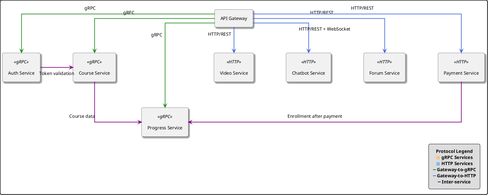
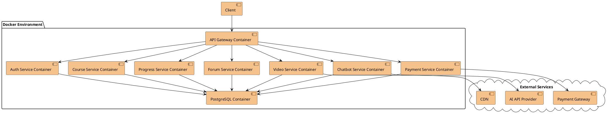
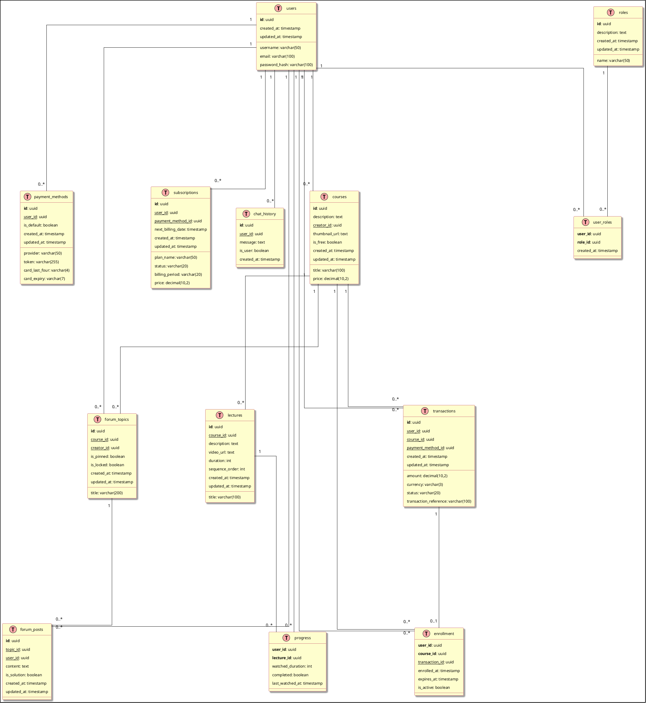
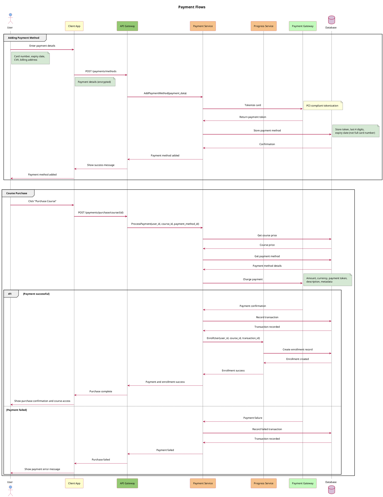

# Online Learning Platform - Architecture Diagrams

This document contains architecture diagrams for the Online Learning Platform, illustrating the microservices architecture, communication patterns, and data flow.

## System Architecture Overview

```plantuml
@startuml
!define RECTANGLE class

' Define custom styles for components
skinparam {
  BackgroundColor<<Frontend>> #85BBF0
  BackgroundColor<<Gateway>> #94C973
  BackgroundColor<<Service>> #F6C28B
  BackgroundColor<<Database>> #D8BFD8
  BackgroundColor<<ExternalService>> #C2FABC
  BackgroundColor<<Storage>> #FFD700
  FontColor black
  BorderColor black
  ArrowColor black
  DefaultFontSize 14
  DefaultTextAlignment center
  Padding 5
  Margin 10
  RoundCorner 10
  DiagramBorderThickness 2
  DiagramBorderColor black
  Shadowing true
}

' Configure layout for vertical diagram
skinparam linetype ortho
skinparam nodesep 80
skinparam ranksep 100

' Main components - vertical layout
rectangle "Client Applications" as client <<Frontend>> {
  [Web Application] as web_app
  [Mobile App] as mobile_app
}

rectangle "API Gateway" as api_gateway <<Gateway>>

' Services in the middle layer
rectangle "Auth Service" as auth_service <<Service>>
rectangle "Course Service" as course_service <<Service>>
rectangle "Progress Service" as progress_service <<Service>>

' Video services with bucket
rectangle "Video Service" as video_service <<Service>> {
  [Video Processing]
  [Video Streaming]
  [Access Control]
}

rectangle "Bucket Service" as bucket_service <<Storage>> {
  [Video Storage]
  [Metadata Management]
  [File Versioning]
}

rectangle "Chatbot Service" as chatbot_service <<Service>>
rectangle "Forum Service" as forum_service <<Service>>
rectangle "Payment Service" as payment_service <<Service>>

' Database layer
rectangle "PostgreSQL Database" as postgres <<Database>>

' External services
rectangle "AI API Provider" as ai_api <<ExternalService>>
rectangle "Payment Gateway" as payment_gateway <<ExternalService>>
rectangle "CDN" as cdn <<ExternalService>>

' Vertical arrangement with multiple layers
' Layer 1: Client
client -[thickness=2]-> api_gateway

' Layer 2: API Gateway
api_gateway -[thickness=2,#228B22]d-> auth_service
api_gateway -[thickness=2,#228B22]d-> course_service
api_gateway -[thickness=2,#228B22]d-> progress_service
api_gateway -[thickness=2,#228B22]d-> video_service
api_gateway -[thickness=2,#228B22]d-> chatbot_service
api_gateway -[thickness=2,#228B22]d-> forum_service
api_gateway -[thickness=2,#228B22]d-> payment_service

' Layer 3: Services to Database
auth_service -[thickness=2,#4B0082]d-> postgres
course_service -[thickness=2,#4B0082]d-> postgres
progress_service -[thickness=2,#4B0082]d-> postgres
video_service -[thickness=2,#4B0082]d-> postgres
chatbot_service -[thickness=2,#4B0082]d-> postgres
forum_service -[thickness=2,#4B0082]d-> postgres
payment_service -[thickness=2,#4B0082]d-> postgres

' Video service to bucket service
video_service -[thickness=2,#FF8C00]r-> bucket_service

' Layer 4: External services connections
bucket_service -[thickness=2,#CD5C5C]r-> cdn
chatbot_service -[thickness=2,#CD5C5C]r-> ai_api
payment_service -[thickness=2,#CD5C5C]r-> payment_gateway

legend right
  <b>Online Learning Platform</b>
  <b><color:#85BBF0>■</color> Frontend Layer</b>
  <b><color:#94C973>■</color> Gateway Layer</b>
  <b><color:#F6C28B>■</color> Service Layer</b>
  <b><color:#D8BFD8>■</color> Database Layer</b>
  <b><color:#FFD700>■</color> Storage Layer</b>
  <b><color:#C2FABC>■</color> External Services</b>
endlegend

@enduml
```

## Service Communication Diagram

## Data Flow Diagram

```plantuml
@startuml
!define RECTANGLE class

skinparam component {
  BackgroundColor #F6C28B
  FontColor black
  BorderColor black
  ArrowColor black
}

rectangle "User" as user
rectangle "API Gateway" as api_gateway
rectangle "Auth Service" as auth_service
rectangle "Course Service" as course_service
rectangle "Progress Service" as progress_service
rectangle "Video Service" as video_service
rectangle "Chatbot Service" as chatbot_service
rectangle "Forum Service" as forum_service
rectangle "Payment Service" as payment_service
rectangle "PostgreSQL" as db
rectangle "AI API Provider" as ai_api
rectangle "Payment Gateway" as payment_gateway

' User registration and login flow
user -> api_gateway : "1. Register/Login request"
api_gateway -> auth_service : "2. Forward auth request"
auth_service -> db : "3. Store/validate user credentials"
db -> auth_service : "4. Return user data"
auth_service -> api_gateway : "5. Return JWT token"
api_gateway -> user : "6. Return JWT token"

' Course enrollment flow
user -> api_gateway : "1. Browse courses"
api_gateway -> course_service : "2. Request course list"
course_service -> db : "3. Fetch courses"
db -> course_service : "4. Return course data"
course_service -> api_gateway : "5. Return course list"
api_gateway -> user : "6. Display courses"

user -> api_gateway : "7. Purchase course"
api_gateway -> payment_service : "8. Process payment"
payment_service -> payment_gateway : "9. Charge payment method"
payment_gateway -> payment_service : "10. Payment confirmation"
payment_service -> db : "11. Store transaction"
payment_service -> progress_service : "12. Enroll user"
progress_service -> db : "13. Create enrollment record"
progress_service -> api_gateway : "14. Enrollment confirmation"
api_gateway -> user : "15. Enrollment success"

' Learning flow
user -> api_gateway : "1. Access course content"
api_gateway -> progress_service : "2. Check enrollment"
progress_service -> db : "3. Verify enrollment"
db -> progress_service : "4. Enrollment status"
progress_service -> api_gateway : "5. Confirm access"
api_gateway -> course_service : "6. Request lectures"
course_service -> db : "7. Fetch lectures"
db -> course_service : "8. Return lecture data"
course_service -> api_gateway : "9. Return lecture list"
api_gateway -> user : "10. Display lectures"

user -> api_gateway : "11. Watch video"
api_gateway -> video_service : "12. Stream video request"
video_service -> db : "13. Get video metadata"
db -> video_service : "14. Video metadata"
video_service -> api_gateway : "15. Stream video"
api_gateway -> user : "16. Video content"

user -> api_gateway : "17. Update progress"
api_gateway -> progress_service : "18. Save progress"
progress_service -> db : "19. Update progress record"
db -> progress_service : "20. Confirmation"
progress_service -> api_gateway : "21. Progress updated"
api_gateway -> user : "22. Progress confirmation"

' Chatbot interaction
user -> api_gateway : "1. Ask question"
api_gateway -> chatbot_service : "2. Forward question"
chatbot_service -> ai_api : "3. Process with AI"
ai_api -> chatbot_service : "4. AI response"
chatbot_service -> db : "5. Store chat history"
chatbot_service -> api_gateway : "6. Return answer"
api_gateway -> user : "7. Display answer"

' Forum interaction
user -> api_gateway : "1. View forum topics"
api_gateway -> forum_service : "2. Request topics"
forum_service -> db : "3. Fetch topics"
db -> forum_service : "4. Return topics"
forum_service -> api_gateway : "5. Return topic list"
api_gateway -> user : "6. Display topics"

user -> api_gateway : "7. Create post"
api_gateway -> forum_service : "8. Save post"
forum_service -> db : "9. Store post data"
db -> forum_service : "10. Confirmation"
forum_service -> api_gateway : "11. Post created"
api_gateway -> user : "12. Post confirmation"

@enduml
```

## Deployment Architecture

## Database Relationship Diagram

## Authentication Flow

```plantuml
@startuml
' Configure vertical layout
skinparam {
  ParticipantBackgroundColor #FEFECE
  ParticipantBorderColor #A80036
  ParticipantFontColor black
  ParticipantFontSize 16
  DatabaseBackgroundColor #D8BFD8
  DatabaseBorderColor #A80036
  DatabaseFontColor black
  DatabaseFontSize 16
  ActorBackgroundColor #85BBF0
  ActorBorderColor #A80036
  ActorFontColor black
  ActorFontSize 16
  ArrowColor #A80036
  ArrowThickness 2
  DefaultFontSize 14
  LifelineStrategy solid
  SequenceMessageAlignment center
  BoxPadding 10
  ParticipantPadding 20
  Padding 10
}

' Increase spacing
skinparam ParticipantPadding 30
skinparam BoxPadding 10
skinparam Padding 10
skinparam SequenceMessageAlignment center
skinparam SequenceGroupBodyBackgroundColor transparent

' Title
title <font size=20>Authentication Flow</font>

' Participants - ordered vertically
actor "User" as User #85BBF0
participant "Client App" as Client #FEFECE
participant "API Gateway" as Gateway #94C973
participant "Auth Service" as AuthService #F6C28B
database "Database" as DB #D8BFD8

' Add spacing
||20||

' === Registration flow (with vertical spacing) ===
group <b>User Registration</b>
    User -> Client : Enter registration details
    note right of User #D5E8D4
      Username, email, password,
      and optional profile information
    end note

    ||10||

    Client -> Gateway : POST /auth/register
    note right of Client #D5E8D4
      JSON payload with user details
    end note

    ||10||

    Gateway -> AuthService : Register(user_data)

    ||10||

    AuthService -> DB : Check if user exists
    DB --> AuthService : User existence status

    ||10||

    alt User doesn't exist
        AuthService -> AuthService : Hash password
        AuthService -> DB : Store user credentials
        DB --> AuthService : Confirmation
        AuthService -> AuthService : Generate JWT
        AuthService --> Gateway : Return JWT and user info
        Gateway --> Client : Registration success + JWT
        Client --> User : Show success message
    else User already exists
        AuthService --> Gateway : User already exists error
        Gateway --> Client : Registration failed
        Client --> User : Show error message
    end
end

||40||

' === Login flow (with vertical spacing) ===
group <b>User Login</b>
    User -> Client : Enter login credentials
    note right of User #D5E8D4
      Email/username and password
    end note

    ||10||

    Client -> Gateway : POST /auth/login

    ||10||

    Gateway -> AuthService : Login(credentials)

    ||10||

    AuthService -> DB : Validate credentials
    DB --> AuthService : User data

    ||10||

    alt Valid credentials
        AuthService -> AuthService : Generate JWT
        AuthService --> Gateway : Return JWT and user info
        Gateway --> Client : Login success + JWT
        Client --> User : Redirect to dashboard
    else Invalid credentials
        AuthService --> Gateway : Authentication failed
        Gateway --> Client : Login failed
        Client --> User : Show error message
    end
end

||40||

' === Token validation flow (with vertical spacing) ===
group <b>Token Validation</b>
    Client -> Gateway : Request with JWT header
    note right of Client #D5E8D4
      Authorization: Bearer [token]
    end note

    ||10||

    Gateway -> AuthService : ValidateToken(token)

    ||10||

    AuthService -> AuthService : Verify JWT signature

    ||10||

    alt Valid token
        AuthService --> Gateway : Token valid + user info
        Gateway -> Gateway : Process request with user context
        Gateway --> Client : Protected resource
        Client --> User : Display protected content
    else Invalid/expired token
        AuthService --> Gateway : Token invalid
        Gateway --> Client : 401 Unauthorized
        Client --> User : Redirect to login
    end
end

@enduml
```

## Payment Flow

## Video Streaming Flow

```plantuml
@startuml
' Configure vertical layout
skinparam {
  ParticipantBackgroundColor #FEFECE
  ParticipantBorderColor #A80036
  ParticipantFontColor black
  ParticipantFontSize 16
  DatabaseBackgroundColor #D8BFD8
  DatabaseBorderColor #A80036
  DatabaseFontColor black
  DatabaseFontSize 16
  ActorBackgroundColor #85BBF0
  ActorBorderColor #A80036
  ActorFontColor black
  ActorFontSize 16
  ArrowColor #A80036
  ArrowThickness 2
  DefaultFontSize 14
  LifelineStrategy solid
  SequenceMessageAlignment center
  BoxPadding 10
  ParticipantPadding 20
  Padding 10
}

' Increase spacing
skinparam ParticipantPadding 30
skinparam BoxPadding 10
skinparam Padding 10
skinparam SequenceMessageAlignment center
skinparam SequenceGroupBodyBackgroundColor transparent

' Title
title <font size=20>Video Streaming Flow</font>

' Participants - ordered vertically
actor "User" as User #85BBF0
participant "Client App" as Client #FEFECE
participant "API Gateway" as Gateway #94C973
participant "Progress Service" as ProgressService #F6C28B
participant "Video Service" as VideoService #F6C28B
participant "Bucket Service" as BucketService #FFD700
participant "CDN" as CDN #C2FABC
database "Database" as DB #D8BFD8

' === Video streaming flow ===
group <b>Video Streaming</b>
    User -> Client : Click play video
    note right of User #D5E8D4
      User selects a lecture video to watch
    end note

    ||10||

    Client -> Gateway : GET /videos/{id}/stream

    ||10||

    Gateway -> ProgressService : CheckAccess(user_id, video_id)

    ||10||

    ProgressService -> DB : Verify enrollment
    note right #D5E8D4
      Check if user is enrolled in course
      and has access to this video
    end note

    ||10||

    DB --> ProgressService : Access granted

    ||10||

    ProgressService --> Gateway : Access confirmed

    ||10||

    Gateway -> VideoService : GetVideoStream(video_id)

    ||10||

    VideoService -> DB : Get video metadata

    ||10||

    DB --> VideoService : Video metadata
    note right #D5E8D4
      Returns video format, length,
      quality options, bucket location
    end note

    ||10||

    VideoService -> BucketService : RequestVideo(video_location)

    ||10||

    alt Direct streaming
        BucketService -> BucketService : Generate signed URL
        BucketService --> VideoService : Return signed URL
        VideoService --> Gateway : Return signed streaming URL
        Gateway --> Client : Redirect to streaming URL
        Client -> BucketService : GET video content with signed URL
        BucketService --> Client : Stream video chunks
    else CDN delivery
        BucketService -> CDN : Request video segments
        CDN --> BucketService : Video segments
        BucketService --> VideoService : Return CDN URLs
        VideoService --> Gateway : Return CDN streaming URLs
        Gateway --> Client : CDN streaming URLs
        Client -> CDN : GET video segments
        CDN --> Client : Stream video segments
    end

    ||10||

    Client --> User : Play video
end

||40||

' === Video progress tracking flow ===
group <b>Progress Tracking</b>
    User -> Client : Video progress update
    note right of User #D5E8D4
      User watches video and
      progress is tracked automatically
    end note

    ||10||

    Client -> Gateway : PUT /progress/update
    note right #D5E8D4
      Sends current timestamp,
      completed status
    end note

    ||10||

    Gateway -> ProgressService : UpdateProgress(user_id, video_id, progress)

    ||10||

    ProgressService -> DB : Update progress record

    ||10||

    DB --> ProgressService : Progress updated

    ||10||

    ProgressService --> Gateway : Update success

    ||10||

    Gateway --> Client : Progress saved

    ||10||

    Client --> User : Show progress indicator
end

||40||

' === Video upload flow ===
group <b>Video Upload (Admin/Instructor)</b>
    User -> Client : Upload new video

    ||10||

    Client -> Gateway : POST /videos/upload
    note right #D5E8D4
      Multipart form data with
      video file and metadata
    end note

    ||10||

    Gateway -> VideoService : ProcessVideoUpload(file, metadata)

    ||10||

    VideoService -> VideoService : Validate video

    ||10||

    VideoService -> BucketService : StoreVideo(video_file)

    ||10||

    BucketService -> BucketService : Process video
    note right #D5E8D4
      Generate multiple formats
      Create thumbnails
      Extract metadata
    end note

    ||10||

    BucketService --> VideoService : Storage confirmation

    ||10||

    VideoService -> DB : Store video metadata
    note right #D5E8D4
      Save bucket location, formats,
      duration, course association
    end note

    ||10||

    DB --> VideoService : Metadata saved

    ||10||

    VideoService -> CDN : Invalidate cache (if updating)
    CDN --> VideoService : Cache invalidation confirmed

    ||10||

    VideoService --> Gateway : Upload success

    ||10||

    Gateway --> Client : Video uploaded successfully

    ||10||

    Client --> User : Show success message
end

@enduml
```

